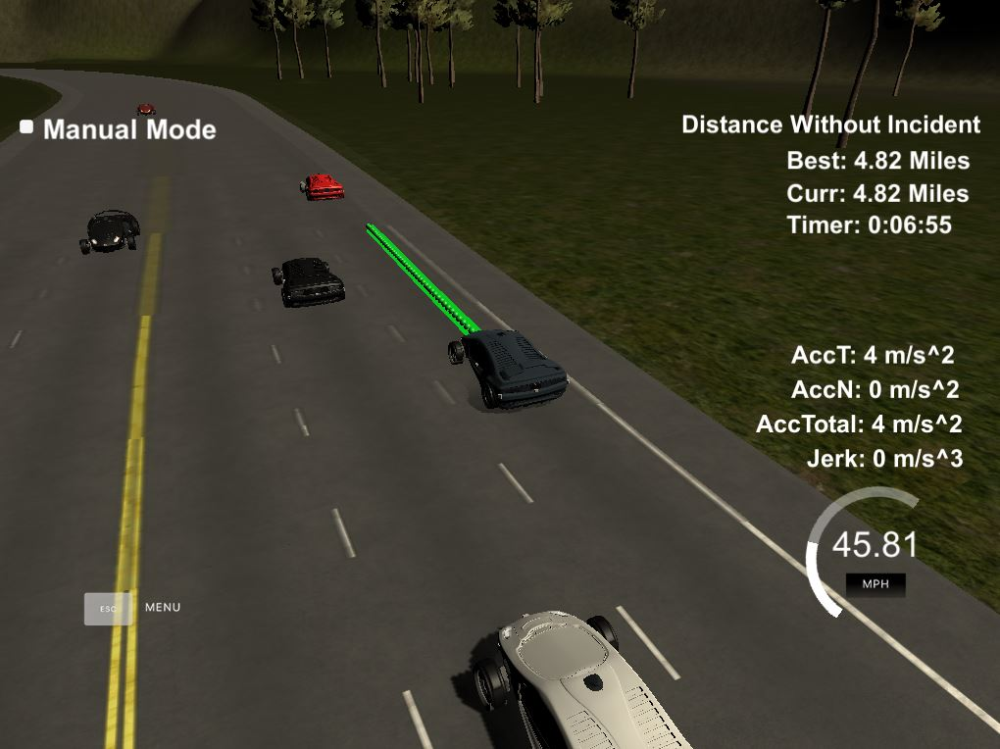
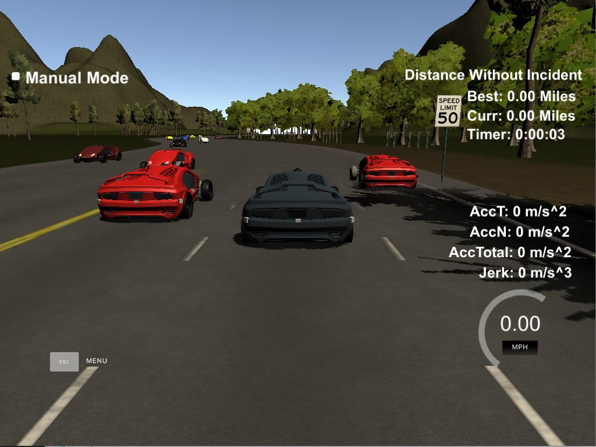
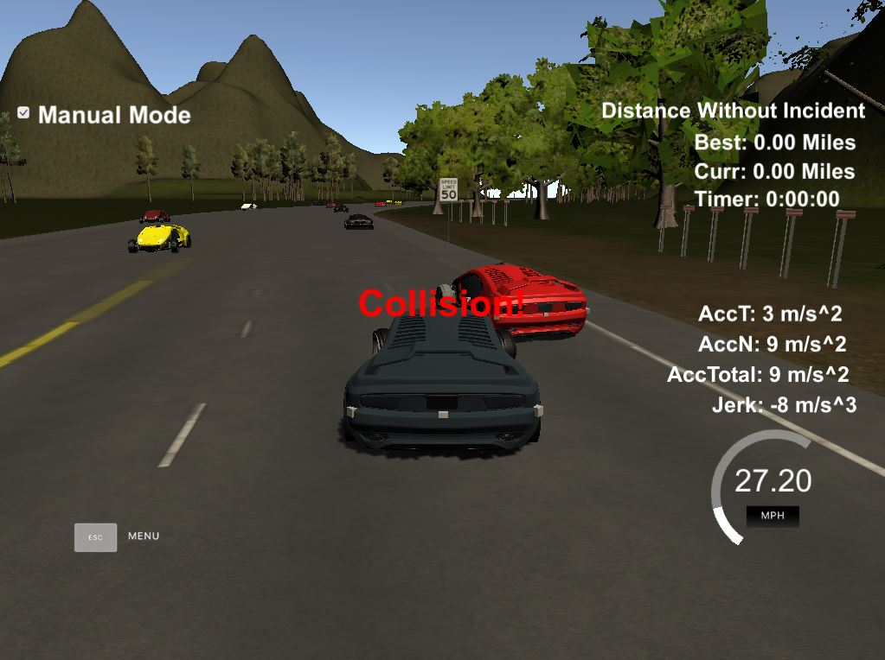

# Project: Highway Driving Path Planner

[](http://www.udacity.com/drive)

The Path Planner safely navigates the car around the virtual highway for at least 4.32 miles without incident:



Feel free to check out the video from testing the [Path Planner application demo](https://youtu.be/kZxnT4Eg8JI).
   
Overview
---

The purpose of this project was to implement a C++ Path Planner that navigates the car safely around a simulated highway. Developing the Path Planner involved 3 steps: prediction, behavior planning and trajectory generation. Testing the Path Planner involved verifying that the car was able to drive for at least 4.32 miles without incident, stays within the speed limit of 50mph, does not have collisions, stays within in its lane except for the time between changing lanes and does not exceed max acceleration and jerk.

Path Planning Background
---

Path Planning is how the vehicle generates safe drivable trajectories to get where we need it to go. We use computer vision and sensor fusion data to understand the environnment around us. Localization data is used to understand where we are in that environment. The Path Planning block uses all that data to decide which maneuver to take next. Then it constructs the trajectory for the controller to execute.

Contents
---

- **[src/](src/)**: contains source code for the project
- **[src/main.cpp](src/main.cpp)**: main file is executed after running **./run.sh** shell script. main.cpp acts as a web server that reads localization and sensor fusion data from the simulator client. main.cpp then performs a **prediction** to identify which lanes (left, right, same) the other cars are in while our car is driving using sensor fusion data. main.cpp executes **behavior planning** to decide what our car should do next, such as merge left, speed up, etc, based on what it learned about the other cars from the prediction. main.cpp runs **trajectory generation** using spline to create smooth, drivable and collision-free trajectories for the motion controller to follow.
- **[docs](docs)**: contains images
- **[data](data)**: contains input data to the Path Planner. This folder has **highway_map.csv** file, which includes a list of waypoints that go all the way around the track. The track contains a total of 181 waypoints with the last waypoint mapping back around to the first. The waypoints are in the middle of the double-yellow dividing line in the center of the highway. The track is 6945.554 meters around (4.32 miles). If the averages 50mph, it should finish 1 lap around the highway in about 5 minutes.
- **[build.sh](build.sh)**: creates build directory, compiles the project into an executable file **path_planning**
- **[run.sh](run.sh)**: executes the **path_planning** program
- **[clean.sh](clean.sh)**: removes the build folder and cleans the project
- **[install-ubuntu.sh](install-ubuntu.sh)**: contains bash code to install the tools necessary to run the Path Planning project on linux. This script can be run inside Windows 10 Bash on Ubuntu. There is a similar install script for mac.
- **[CMakeLists.txt](CMakeLists.txt)**: contains directives and instructions describing the project's source files and targets (executable, library, or both). It is a build configuration file that cmake uses to generate makefiles. Then the make command is used to manage compiling the project, use a compiler to compile the program and generate executables. In our case, we retrieve the **path_planning** executable file, machine language, that runs the c++ program directly on the computer.

Reflection
---

When cloning the [udacity path planning github repo](https://github.com/udacity/CarND-Path-Planning-Project), this project comes with code that has the C++ web server read sensor fusion and localization data from the simulator client using uWebSockets. 

All the code for the Path Planning portion of the application was written in the **main.cpp** from line 102 to 368. Some useful resources that helped me in the project included Udacity project Q&A walkthrough video, lesson 7 - foundational search algorithms in discrete Path Planning, lesson 8 - predicting the behavior of the other cars around us, lesson 9 - behavior planning for what the car shall do based on what it learned from the prediction data and lesson 10 - trajectory generation. Also referencing other people's approaches to solving the Path Planning problem helped in simplifying the complexity of the project. I decided to keep the Path Planning code in main.cpp for simplicity and added comments for code readability.

The Path Planning code consists of 3 parts.

### Prediction (lines 102 to 181)

The prediction portion of the Path Planner works with sensor fusion, localization and previous path data. The purpose of the prediction step is to learn about the objects around our car and answer questions based on that perception:

- Is there another car ahead of our car and is our car too close to the other car?
- Is there another car in the left lane making a left merge unsafe?
- Is there another car in the right lane making a right merge unsafe?

This information is gathered using frenet coordinates, velocity and some math. For safe distance between cars, the distance between our car and other cars must be less than 30 meters in front or behind. The answers to these questions are saved, so the behavior planner can make safe decisions for the car.

### Behavior Planning (lines 183 to 221)

The behavior planner takes the data from the predictions and decides how the car should navigate safely on the highway. The behavior planner decides:

- If there is another car in front of our car, is it safe to merge into the left lane, right lane or stay in the same lane? If we can't merge into another lane, do we slow down?
- If there isn't another car in front of our car and we are in the leftmost or rightmost lane, is it safe to merge back to the middle lane?
- If there isn't another car in front of our car, do we speed up?

Based on the predicted situation, our car will slow down, speed up or merge into a lane if safe. The speed isn't actually changed until trajectory generation, which allows for faster response time when another car performs an action that may cause an accident, such as applying breaks to cause a collision.

### Trajectory Generation (lines 223 to 368)

The trajectory generation is calculated with the help of splines based on the decisions made by the behavior planner, car's lane position, speed and the historical path points.

To calculate the spline requires the last 2 points from the previous path trajectory (if there isn't previous path trajectory points, then the previous position is used) and 3 waypoints 30 meters apart (30, 60, 90 meters). The frenet helper function was used to generate the 3 waypoints. To make the math easier for calculating the spline, a shift and rotation is applied to transform waypoints map coordinates to local vehicle coordinate.

To ensure continuity of trajectory, we don't have to recreate the path from scratch each time instead we load up the future trajectory path with what was left of the previous path. Then we calculate how to break up spline points, so we can travel at our desired reference velocity. Finally, we add those points along the spline by evaluating the spline and transforming the output local vehicle coordinates back to waypoints map coordinates. 

Dependencies for Running Demo
---

This project requires the **Term 3 Simulator**, which can be downloaded from this [GitHub link](https://github.com/udacity/self-driving-car-sim/releases/tag/T3_v1.2).

* cmake >= 3.5
  * All OSes: [click here for installation instructions](https://cmake.org/install/)
* make >= 4.1
  * Linux: make is installed by default on most Linux distros
  * Mac: [install Xcode command line tools to get make](https://developer.apple.com/xcode/features/)
  * Windows: [Click here for installation instructions](http://gnuwin32.sourceforge.net/packages/make.htm)
* gcc/g++ >= 5.4
  * Linux: gcc / g++ is installed by default on most Linux distros
  * Mac: same deal as make - [install Xcode command line tools]((https://developer.apple.com/xcode/features/)
  * Windows: recommend using [MinGW](http://www.mingw.org/)
* [uWebSockets](https://github.com/uWebSockets/uWebSockets)
  * Run either `install-mac.sh` or `install-ubuntu.sh`.
  * If you install from source, checkout to commit `e94b6e1`, i.e.
    ```
    git clone https://github.com/uWebSockets/uWebSockets 
    cd uWebSockets
    git checkout e94b6e1
    ```

How to Run Demo
---

### Build & Compile the Path Planning Program

Open your terminal (Windows 10 Ubuntu Bash Shell, Linux Shell, Mac OS X Shell), then copy the project onto your computer:

~~~bash
git clone https://github.com/james94/P7-Highway-Driving-CarND
~~~

This project requires using open source package **[uWebSocketIO](https://github.com/uNetworking/uWebSockets)**. This package facilitates the connection between the simulator and C++ code used in this EKF project by setting up a web socket server connection from the C++ program to the simulator. The C++ program software is a web server and the simulator is a client. There are two scripts for installing **uWebSocketIO** - one for Linux and the other for macOS. 

Run the shell script below to install **uWebSocketIO**, build and compile the C++ EKF program:

~~~bash
cd P7-Highway-Driving-CarND
# Linux or Windows 10 Ubuntu (18.04) Bash Shell
./install-ubuntu.sh

# Mac OS X Shell
./install-mac.sh
~~~

> **WARNING**: for the above shell script, choose the one appropriate for your OS

At the end of the install script, the **make** build automation tool uses the compiler to compile the project and the following executable program **path_planning** will be generated in the **build** folder. Run the Path Planning program with the command below:

~~~bash
./run.sh
~~~

Let's say you make updates to the C++ Path Planning program, all we need to do is rerun the build and compile commands using the shell commands below:

~~~bash
./build.sh
~~~

Rerun the Path Planning program with the command below:

~~~bash
./run.sh
~~~

The output you will receive in your terminal:

~~~bash
Listening to port 4567
~~~

Now we need to finish connecting the C++ program to the simulator.

### Launch the Simulator and Connect the C++ Program

Go to the folder where  you downloaded **Term 3 Simulator**, decompress the **term3_sim_{your_OS}** and double click on **term3_sim** to launch the program.

Click **Play!**. Select **Project 1: Path Planning**.

Now referring back to your terminal, you should see an update:

~~~bash
Listening to port 4567
Connected!!!
~~~

Now the simulator and the C++ program are connected. 

### Test Path Planner Navigating Car on Virtual Highway

If you have not yet run the C++ program, the car will be initially stationary as below:



If you have executed the C++ program, the Path Planner should start immediately navigating the car around the highway as can be seen in this video of the [Path Planner application demo](https://youtu.be/kZxnT4Eg8JI)

What is happening is the Path Planner is receiving sensor fusion, localization and previous path data from the **simulator client**. Then the distance without incident is being tracked for miles and time. Additionally the velocity, acceleration and jerk are being monitored too.

The simulator will report to you right away when a traffic law is violated, such as a collision:



To pass the project, I met the following requirements for valid trajectories based on the Udacity rubric:

- The car is able to drive at least 4.32 miles without incident
- The car drives according to the speed limit
- Max acceleartion and jerk are not exceeded
- Car does not have collisions
- The car stays in its lane, except for the time between changing lanes
- The car is able to change lanes

### Conclusion

Congratulations! You just ran the demo for a Path Planner C++ program with a Unity simulator. We saw visualized metadata, such as distance in miles and time driven along a virtual highway. We also had to create a Path Planning program that was able to meet certain safe driving requirements. After testing my Path Planning program, I verified that it could navigate the car safely around the virtual highway for more than 11 miles before I decided to stop both the C++ program and Unity simulator.

### Data Between Client and Server

Here is the data provided from the Simulator to the C++ Program

#### Main car's localization Data (No Noise)

["x"] The car's x position in map coordinates

["y"] The car's y position in map coordinates

["s"] The car's s position in frenet coordinates

["d"] The car's d position in frenet coordinates

["yaw"] The car's yaw angle in the map

["speed"] The car's speed in MPH

#### Previous path data given to the Planner

//Note: Return the previous list but with processed points removed, can be a nice tool to show how far along
the path has processed since last time. 

["previous_path_x"] The previous list of x points previously given to the simulator

["previous_path_y"] The previous list of y points previously given to the simulator

#### Previous path's end s and d values 

["end_path_s"] The previous list's last point's frenet s value

["end_path_d"] The previous list's last point's frenet d value

#### Sensor Fusion Data, a list of all other car's attributes on the same side of the road. (No Noise)

["sensor_fusion"] A 2d vector of cars and then that car's [car's unique ID, car's x position in map coordinates, car's y position in map coordinates, car's x velocity in m/s, car's y velocity in m/s, car's s position in frenet coordinates, car's d position in frenet coordinates. 

## Details

1. The car uses a perfect controller and will visit every (x,y) point it recieves in the list every .02 seconds. The units for the (x,y) points are in meters and the spacing of the points determines the speed of the car. The vector going from a point to the next point in the list dictates the angle of the car. Acceleration both in the tangential and normal directions is measured along with the jerk, the rate of change of total Acceleration. The (x,y) point paths that the planner recieves should not have a total acceleration that goes over 10 m/s^2, also the jerk should not go over 50 m/s^3. (NOTE: As this is BETA, these requirements might change. Also currently jerk is over a .02 second interval, it would probably be better to average total acceleration over 1 second and measure jerk from that.

2. There will be some latency between the simulator running and the Path Planner returning a path, with optimized code usually its not very long maybe just 1-3 time steps. During this delay the simulator will continue using points that it was last given, because of this its a good idea to store the last points you have used so you can have a smooth transition. previous_path_x, and previous_path_y can be helpful for this transition since they show the last points given to the simulator controller with the processed points already removed. You would either return a path that extends this previous path or make sure to create a new path that has a smooth transition with this last path.

## Resources

- Udacity SDCE-ND: Path Planning Class
  - Lesson 7: Search
  - Lesson 8: Prediction
  - Lesson 9: Behavior Planning
  - Lesson 10: Trajectory Generation
  - Project: Highway Driving

- Helpful GitHub Repositories
  - [mkoehnke: Path Planning Project](https://github.com/mkoehnke/CarND-Path-Planning-Project)
  - [darienmt: Path Planning Project](https://github.com/darienmt/CarND-Path-Planning-Project-P1)
  - [yeutterg: Path Planning Simulation](https://github.com/yeutterg/CarND-Path-Planning-Project-P11)

A really helpful resource for doing this project and creating smooth trajectories was using http://kluge.in-chemnitz.de/opensource/spline/, the spline function is in a single hearder file is really easy to use.